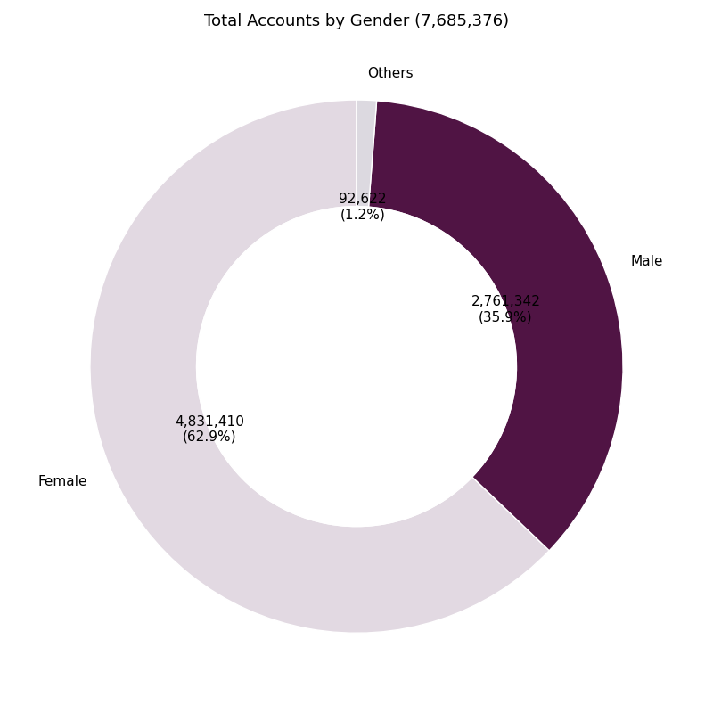
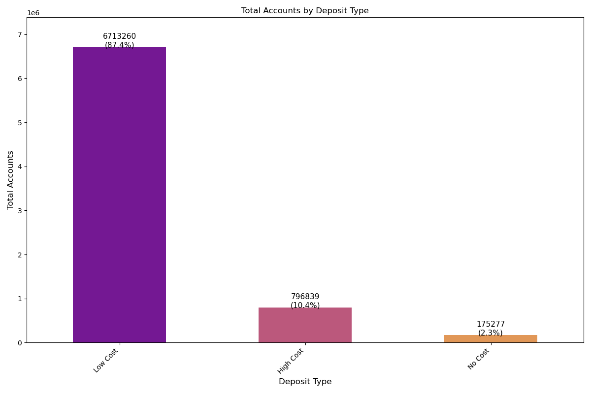
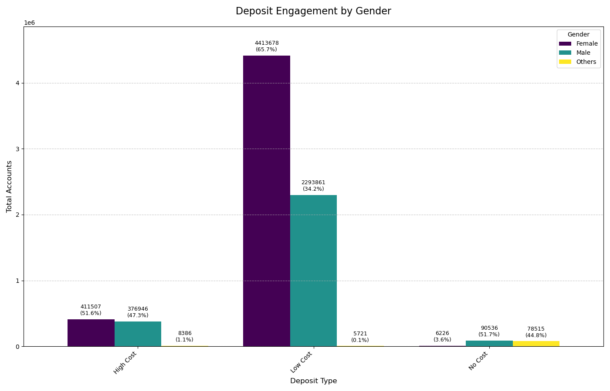
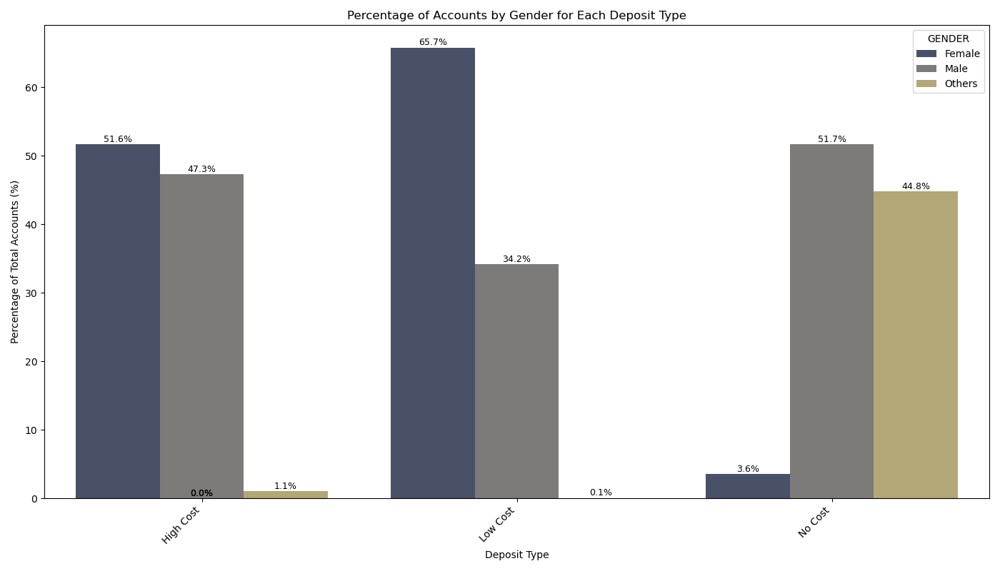

# Gender-Based Account Mix Analysis in Retail Banking

This repository contains the code and data for an analysis of a retail bank's customer account portfolio, segmented by product type and gender. The project uses Python and common data science libraries to uncover insights from the customer data and provide actionable recommendations.

---

### Table of Contents
1.  [Project Overview](#project-overview)
2.  [Key Questions Addressed](#key-questions-addressed)
3.  [Visualizations](#visualizations)
4.  [Key Insights](#key-insights)
5.  [Business Recommendations](#business-recommendations)
6.  [Technologies Used](#technologies-used)
7.  [How to Run](#how-to-run)
8.  [Data Source](#data-source)

---

### Project Overview
The goal of this project is to analyze the distribution of customer accounts across different product types (e.g., High Cost, Low Cost, and No Cost) and genders. By understanding these distributions, a financial institution can identify opportunities for targeted marketing, product development, and strategies to promote financial inclusion.

### Key Questions Addressed
* What is the overall distribution of bank accounts by gender?
* How does account ownership vary across different product categories like "High Cost", "Low Cost" and "No Cost" accounts?
* Which specific products show a significant gender gap, and where are the opportunities for growth?
* What strategic actions can the bank take to better serve underrepresented segments?

---

### Visualizations

This analysis produced several key visualizations to illustrate the findings.

**1. Total Accounts by Gender (Donut Chart):** A high-level view of the gender distribution across all accounts.
---
    

### 🔍 Insights from the "Total Accounts by Gender"

**Gender Distribution Overview**:
   - **Male**: 4,831,410 accounts (62.9%)  
     - Males dominate the account holders, representing nearly two-thirds of the total accounts. This suggests a strong male customer base, possibly due to targeted marketing, product preferences, or socio-economic factors.
   - **Female**: 2,761,342 accounts (35.9%)  
     - Females account for slightly over one-third of the total accounts. The significant gap between male and female account holders could indicate potential areas for outreach or product customization to attract more female customers.
   - **Others**: 92,622 accounts (1.2%)  
     - This category is minimal but noteworthy. The bank may need to ensure inclusivity in its services and consider whether this reflects broader societal demographics or potential underrepresentation.

### 📊 Strategic Implications

   - **Product and Marketing Strategies**: The disparity between male and female account holders suggests that the bank’s products or marketing may resonate more with men. Tailored campaigns or products for women could help bridge this gap.
   - **Inclusivity Efforts**: The small percentage of "Others" highlights an opportunity to enhance inclusivity, potentially through awareness campaigns or products designed for diverse gender identities.
   - **Customer Segmentation**: Further analysis could explore whether the gender distribution aligns with regional or product-specific trends, such as savings vs. investment accounts.

### 🧠 Recommendations:
   - **Investigate Underlying Causes**: Conduct surveys or focus groups to understand why females and non-binary individuals are less represented. Are there barriers (e.g., accessibility, product features)?
   - **Targeted Initiatives**: Launch initiatives to engage underrepresented groups, such as financial literacy programs for women or partnerships with LGBTQ+ organizations.
   - **Monitor Trends**: Track changes over time to assess the impact of any interventions aimed at balancing gender representation.

**2.  Total Accounts by Deposit Type (Bar Chart):** Shows the popularity of different product categories.
---
    

### 🔍 Insights from the "Total Accounts by Deposit Type"

**i. Dominance of Low Cost Accounts**  
   With **87.4% of total accounts**, Low Cost deposits represent the overwhelming majority—over **6.7 million accounts**. This implies a significant customer base seeking affordable banking solutions, possibly driven by inclusive or mass-market strategies like savings or salary accounts.

**ii. Minimal Share of High Cost Accounts**  
   At **10.4% (796K accounts)**, High Cost deposits form a smaller chunk. This might reflect a more selective clientele, possibly tied to high-interest term deposits or less favorable cost-benefit offerings for the customer.

**iii. No Cost Accounts Are Niche**  
   Only **2.3% (175K accounts)** fall into the No Cost category, which could indicate:
   - Limited promotional or zero-fee products
   - Eligibility barriers
   - Or simply that customers prefer Low Cost over truly fee-free options, if other terms are better.

### 📊 Strategic Implications

- **Revenue vs. Volume Tradeoff**  
   While Low Cost accounts boost volume and customer acquisition, they might contribute less to interest margin. A balance with High Cost products could be crucial for profitability.

- **Customer Profiling Opportunity**  
   This distribution could guide segmentation strategies: e.g., cross-selling higher-yielding products to the massive Low Cost segment or tailoring service models accordingly.

- **Scope for Financial Inclusion**  
   If “No Cost” reflects accounts under social or government programs, expanding this category may help meet regulatory or CSR goals.

**3.  Account Engagement by Gender (Grouped Bar Chart):** A comparative view of how genders are represented within each product type.
---
    

### 🔍 Insights by Account Engagement by Gender

#### 🔹 High Cost Accounts
- **Female (51.6%)** slightly outnumber **Male (47.3%)**, suggesting that women are more engaged with higher interest-bearing or premium accounts.
- This could reflect growing financial independence or tailored offerings (e.g., premium savings, fixed deposits) appealing to female account holders.

#### 🔹 Low Cost Accounts
- A **strong female majority (65.7%)** dominates this segment—possibly driven by inclusion efforts (e.g., salary accounts, easy-access savings) and broader outreach campaigns.
- **Male (34.2%)** participation, though sizable, lags significantly.
- **Others (0.1%)** represent a minimal share but indicate some diversity.

#### 🔹 No Cost Accounts
- Surprisingly, **Males (51.7%)** lead this category, followed closely by **Others (44.8%)**, while **Females (3.6%)** are underrepresented.
- The high share of “Others” could signify targeted outreach under special ID, NGO, or financial inclusion programs.

### 📊 Strategic Implications

**i. Gender-Focused Product Strategies**  
   - Enhance offerings for female customers in High and Low Cost segments with personalized value propositions or loyalty programs.
   - Investigate barriers for female entry into No Cost accounts—perhaps digital literacy, awareness, or documentation issues.

**ii. Inclusive Growth Potential**  
   - The significant share of “Others” in No Cost accounts is notable. It underscores progress toward gender diversity and financial inclusion and opens doors for focused service models.

***iii. Cross-Sell Opportunities**  
   - Use Low Cost female-dominant base to upsell to High Cost products.
   - Tailor messaging for male users toward cost-efficient or fee-free accounts.

**4.  Percentage of Accounts by Gender (Bar Chart):** A normalized view showing the percentage split of genders within each deposit type.
---
    

### 🔍 Insights Takeaways

#### 🔹 High Cost Accounts
- **Females: 51.6%** | **Males: 47.3%** | **Others: 1.1%**
- Women narrowly lead this segment, which may suggest growing financial confidence or better alignment of these products with female financial goals (e.g., fixed deposits, premium savings).
- The relatively balanced gender split also points to widespread accessibility.

#### 🔹 Low Cost Accounts
- **Females: 65.7%** | **Males: 34.2%** | **Others: 0.1%**
- A clear female majority—this likely reflects successful financial inclusion efforts like easy-access savings, salary accounts, or government-led schemes aimed at women.
- Male engagement, while substantial, lags by over 30 percentage points, signaling potential outreach gaps.

#### 🔹 No Cost Accounts
- **Males: 51.7%** | **Others: 44.8%** | **Females: 3.6%**
- This segment tells a very different story—an **exceptionally high presence of “Others”** and a stark underrepresentation of females.
- May indicate special account categories (e.g., NGO beneficiaries, marginalized groups) or lack of female access due to social/documentation barriers.

### 📊 Strategic Implications

**i. Refine Product Targeting**  
   - Capitalize on the **strong female presence** in Low Cost and High Cost accounts through cross-sell and retention strategies.
   - Use tailored campaigns to increase **female uptake in No Cost accounts**, possibly addressing accessibility or awareness issues.

**ii. Strengthen Inclusion Metrics**  
   - The “Others” category’s near parity with Males in No Cost accounts is remarkable—it suggests room to highlight or expand this progress in annual reports or CSR dashboards.

**iii. Data-Driven Personalization**  
   - Gender-segmented insights like this can inform **branch-level KPIs**, **mobile banking UI designs**, or even **training for RM staff** on inclusive banking.

---

### Final Business Recommendations
* **Targeted Campaigns:** Develop marketing initiatives to promote "Low Cost" savings products to the male segment.
* **Enhance Product Offerings:** Investigate the features of "No Cost" accounts to make them more attractive to the female segment.
* **Leverage Existing Strengths:** Retain and grow the female customer base in "Low Cost" accounts by introducing loyalty programs or tiered benefits.

---

### Technologies Used
* Python 3.x
* Pandas
* Matplotlib
* Seaborn
* Jupyter Notebook

---

### Data Source
* `product_wise_ac_info.csv`: This file contains the aggregated data on the number of accounts for each product description, segmented by product nature, product type, and gender.
